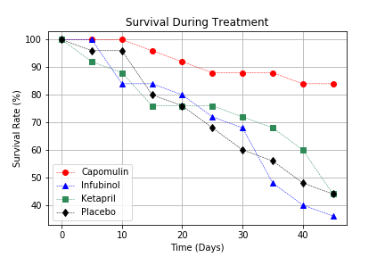

# Drug-Testing
I compared four drug treatments to see how they fare as a potential drug treatment to squamous cell carcinoma, which is a common form of skin cancer.
I looked at data from a recent animal study on mice who were treated with each drug over the course of 45 days.
In this project I used Pandas and Matplotlib to help with the statistical breakdown and visualizations.

